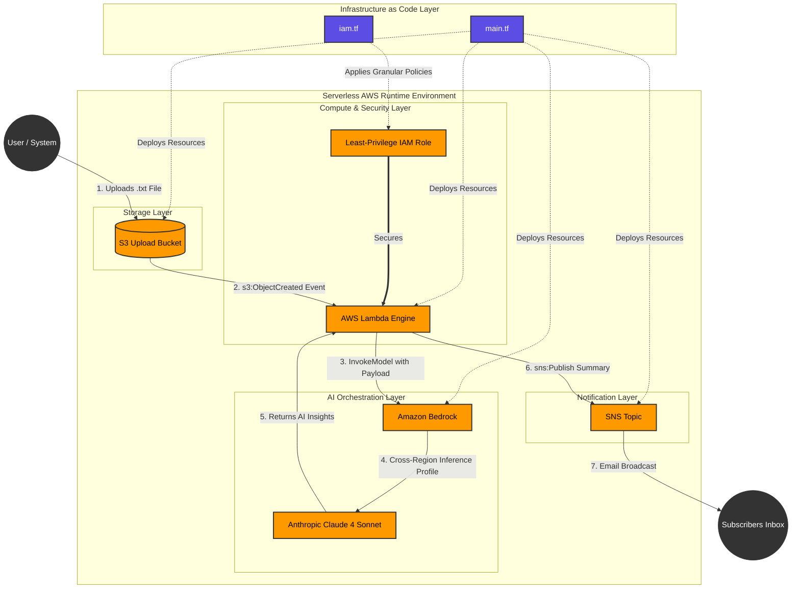

# automated-ai-insights-and-notifications-pipeline

# Event-Driven Serverless AI Insights & Notifications Pipeline
A production-grade, fully automated AWS infrastructure pipeline built entirely with Terraform. This system detects document uploads to an Amazon S3 bucket, triggers a serverless AWS Lambda function to extract text contents, orchestrates a generative AI summarization task via Amazon Bedrock (Anthropic Claude 4 Sonnet), and broadcasts a structured executive summary to an Amazon SNS topic subscription list.

## System Architecture
The infrastructure follows an asynchronous, event-driven serverless pattern engineered for maximum throughput and zero idle costs:

1. **Storage Layer**: Amazon S3 bucket captures unstructured document uploads (`.txt`).
2. **Compute Layer**: AWS Lambda (Python 3.9) processes the asynchronous S3 Object Created notification event payload.
3. **AI Orchestration**: Lambda invokes an Amazon Bedrock Cross-Region Inference Profile to leverage Anthropic Claude 4 Sonnet for context-aware analysis.
4. **Notification Layer**: Generated insights are published to an Amazon SNS Topic, broadcasting immediately to email subscribers.



---

## Technical Highlights & Guardrails
* **State Resilience**: Managed via a remote Amazon S3 backend at the root directory layer to ensure highly reliable state tracking and concurrent locking mechanisms.
* **Granular IAM Security Principle**: Bypasses loose wildcard execution policies. Implements strictly decoupled, least-privilege IAM policy attachments ensuring the Lambda role can only execute `s3:GetObject` on the targeted payload bucket, `sns:Publish` on the specific topic, and `bedrock:InvokeModel` on required global inference paths.
* **Cross-Region Inference Routing**: Optimized to run inside the highly stable `us-east-1` (N. Virginia) topology while dynamically consuming global inference models to bypass single-region concurrency throttles.
* **Zero Orphan Footprint**: Complete lifecycle predictability. Running a tear-down operation cleanly rolls back 100% of generated infrastructure components, leaving zero lingering resources or hidden billing cycles.

---

## Directory Structure
```text
automated-ai-insights-and-notifications-pipeline/
├── main.tf                 # Core infrastructure provider, S3 bucket, SNS topic, and Lambda configurations
├── iam.tf                  # Granular IAM roles, decoupled execution policies, and attachments
├── variables.tf            # Environment input variables (Regions, naming configurations)
├── outputs.tf              # Managed stack outputs (S3 bucket IDs, SNS Topic ARNs)
├── src/
│   └── lambda_function.py  # Python handler incorporating Anthropic payload specifications
└── test.txt                # Sample validation payload
```
